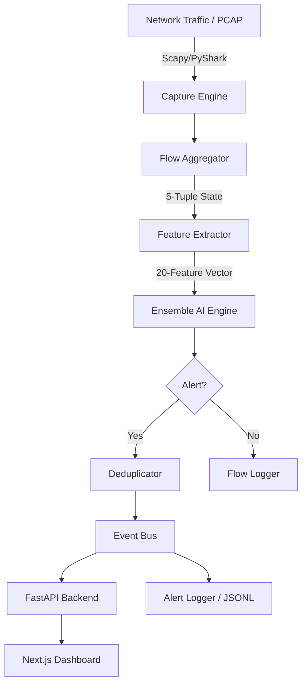

# AI-NIDS Master Guide: Everything You Need to Know

Welcome to the comprehensive guide for **AI-NIDS** — a production-grade, hybrid Network Intrusion Detection System. This system combines supervised machine learning, unsupervised anomaly detection, and traditional signature-based rules to protect your network from both known threats and novel "zero-day" attacks.

---

## 📖 Table of Contents

1.  [The Big Picture (Architecture)](#1-the-big-picture-architecture)
2.  [Before You Begin (Prerequisites)](#2-before-you-begin-prerequisites)
3.  [Installation & Setup](#3-installation--setup)
4.  [Operating Mode: Training (The Foundation)](#4-operating-mode-training-the-foundation)
5.  [Operating Mode: Development & Debugging](#5-operating-mode-development--debugging)
6.  [Operating Mode: Live Monitoring (Standard)](#6-operating-mode-live-monitoring-standard)
7.  [Operating Mode: Production & Autonomy](#7-operating-mode-production--autonomy)
8.  [Operating Mode: Demo (No Root Needed)](#8-operating-mode-demo-no-root-needed)
9.  [How it Works: Under the Hood](#9-how-it-works-under-the-hood)
10. [Management & Tuning](#10-management--tuning)
11. [Troubleshooting & Health Checks](#11-troubleshooting--health-checks)

---

## 1. The Big Picture (Architecture)

AI-NIDS operates as a high-performance pipeline that transforms raw network packets into actionable security alerts.

### The Pipeline Flow



### Key Components
- **Capture Engine**: High-fidelity packet ingestion.
- **Flow Aggregator**: Groups packets into bidirectional "conversations" (flows).
- **Ensemble AI**: A weighted vote between **Random Forest** (known attacks) and an **Autoencoder** (anomalies).
- **Signature Engine**: Evaluates flows against a hot-reloadable YAML ruleset.
- **Dashboard**: A real-time, Next.js-powered visual interface.

---

## 2. Before You Begin (Prerequisites)

To ensure a smooth experience, verify these requirements before running any commands.

### OS & Hardware
- **Operating System**: Linux is required for live capture (Kali or Ubuntu recommended).
- **Network Card**: Must support Promiscuous Mode for monitoring shared traffic.
- **Memory**: 4GB RAM minimum (8GB recommended for training the Autoencoder).

### The "Permission Wall" (Sudo)
Capturing raw network traffic requires root privileges. You have two choices:
1.  **Run with `sudo`**: Easiest, but requires entering your password for every run.
2.  **Grant Capabilities**: Grant the Python binary specific network capture rights:
    ```bash
    sudo setcap cap_net_raw+eip $(which python3)
    ```

### External Data
AI-NIDS is built on the **CICIDS2017** dataset. While we provide a script to fetch it automatically, be aware that the full dataset is ~3GB.

---

## 3. Installation & Setup

Follow these steps to prepare your environment.

### A. System Dependencies
```bash
sudo apt update
sudo apt install -y python3-pip python3-venv libpcap-dev wireshark-common tcpdump nodejs npm
```

### B. Project Setup
```bash
# Clone the repository
git clone https://github.com/TheHiddenDeveloper/ai-nids.git
cd ai-nids/

# Create and activate a virtual environment
python3 -m venv ai-venv
source ai-venv/bin/activate

# Install Python dependencies
pip install -r requirements.txt
```

### C. Frontend Setup
```bash
cd frontend/
npm install
cd ..
```

---

## 4. Operating Mode: Training (The Foundation)

Before you can detect threats, the "Brain" (AI models) must be trained on network behavior.

### Step 1: Fetch the Dataset
AI-NIDS uses the CICIDS2017 dataset. We provide a script to fetch the necessary CSVs directly.
```bash
python scripts/fetch_cicids.py
```

### Step 2: Train the Models
You can train the supervised model (RF), the unsupervised model (AE), or both.
```bash
# Recommended: Train both for maximum coverage
python scripts/train.py --model both
```
*   **Supervised (RF)**: Learns specific patterns like "DDoS" or "Port Scan."
*   **Unsupervised (AE)**: Learns what "Normal" traffic looks like and flags anything else as an anomaly.

---

## 5. Operating Mode: Development & Debugging

If you are a developer making changes to the code, it is best to run each component in its own terminal to see detailed logs.

1.  **Start the Backend (FastAPI)**:
    ```bash
    uvicorn api.main:app --host 0.0.0.0 --port 8000 --reload
    ```
2.  **Start the Frontend (Next.js)**:
    ```bash
    cd frontend && npm run dev
    ```
3.  **Start the Monitor**:
    ```bash
    sudo python scripts/run_monitor.py --interface eth0
    ```

---

## 6. Operating Mode: Live Monitoring (Standard)

For the typical user, use the **Consolidated Dashboard Mode**. This single command starts the Monitor, API, and Frontend all at once.

```bash
sudo -E env PATH="$PATH" python scripts/run_monitor.py --interface eth0 --dashboard
```

> **Note**: The `-E env PATH="$PATH"` ensures that your virtual environment's Python and dependencies are correctly picked up even when running with `sudo`.

---

## 7. Operating Mode: Production & Autonomy

For permanent protection, run AI-NIDS as a background service using the provided deployment script.

```bash
# Deploy as a systemd service
sudo ./scripts/deploy.sh
```

### Managing the Service
*   **Check Status**: `systemctl status ai-nids`
*   **View Live Logs**: `journalctl -u ai-nids -f`
*   **Restart**: `systemctl restart ai-nids`

---

## 8. Operating Mode: Demo (No Root Needed)

If you don't have a capture-capable network card or want to test a specific capture file, use PCAP replay mode.

```bash
python scripts/run_monitor.py --pcap data/raw/sample.pcap --dashboard
```

---

## 9. How it Works: Under the Hood

To truly master the system, you must understand how a packet becomes an alert.

### The Flow Aggregator
Network traffic is messy. AI-NIDS simplifies it by grouping packets into **Bidirectional Flows**.
*   **The Key**: Every flow is identified by its "5-tuple": (Source IP, Source Port, Dest IP, Dest Port, Protocol).
*   **Stateful Tracking**: We track the number of packets, total bytes, and TCP flags (SYN, ACK, etc.) for each conversation.
*   **Feature Extraction**: Once a flow expires (or is timed out), we compute 20 statistical features (e.g., `avg_packet_len`, `flow_iat_std`) which are then fed into the AI.

### The AI Ensemble
We don't rely on just one model. We use an **Ensemble** of two distinct AI brains:
1.  **Random Forest (Supervised)**: This model was trained on millions of packets from the CICIDS2017 dataset. It knows exactly what a "Botnet" or a "Heartbleed" attack looks like.
2.  **Autoencoder (Unsupervised)**: This is a neural network trained *only* on your normal network traffic. It learns the "shape" of your regular day-to-day activity. If it see a flow that it can't "reconstruct" accurately, it flags it as an anomaly. This is how we catch new attacks that haven't been seen before.

### The Signature Engine
Even with AI, sometimes you want a guarantee. The **Signature Engine** evaluates every flow against a YAML-based ruleset (found in `signatures/rules.yaml`).
*   **Example**: If a flow has >50 SYN packets but <5 ACKs, the signature engine immediately flags it as a "SYN Flood."
*   **Hot-Reloading**: You can update the rules in real-time without stopping the monitor.

---

## 10. Management & Tuning

### The Configuration File (`config.yaml`)
Most behaviors can be tuned without touching code:
*   **`anomaly_threshold`**: Lower this (e.g., to `0.5`) to make the system more sensitive (more alerts, more false positives). Raise it (e.g., to `0.8`) to make it quieter.
*   **`home_net`**: Define your internal network range (e.g., `192.168.1.0/24`) so the system can correctly identify "Inbound" vs "Outbound" traffic.

### Signature Management
Use the signature manager to enable or disable specific rules:
```bash
python scripts/sig_manager.py --list
python scripts/sig_manager.py --disable SYN_FLOOD_001
```

---
## 11. Troubleshooting & Health Checks

Even the best systems encounter hiccups. Here is how to resolve common issues.

### Common Errors & Fixes

| Issue | Cause | Solution |
| :--- | :--- | :--- |
| `Permission denied` | Scapy needs root to listen on sockets. | Use `sudo` or run the `setcap` command from Section 2. |
| `ModuleNotFoundError` | Virtual environment not active. | Run `source ai-venv/bin/activate`. |
| `Interface 'eth0' not found` | Incorrect network interface name. | Run `ip a` to find your interface (e.g., `wlan0`, `enp0s3`). |
| `Model file not found` | Models haven't been trained yet. | Run `python scripts/train.py --model both`. |
| `Dataset not found` | CICIDS2017 files are missing. | Run `python scripts/fetch_cicids.py`. |
| `Address already in use` | Another service is using port 8000 or 3000. | Check running processes: `lsof -i :8000`. |

### Performance Tuning
If you see **High CPU Usage** or **Packet Dropping**:
1.  **Increase Flow Timeout**: In `config.yaml`, set `flow_timeout` to `60` (up from `20`).
2.  **Filter Traffic**: Use the `--bpf` flag to ignore safe traffic (e.g., `sudo python scripts/run_monitor.py --bpf "not port 22"`).

### Health Checks
To verify the system is working correctly:
1.  **Check API**: Visit `http://localhost:8000/health` (should return `{"status": "ok"}`).
2.  **Check Logs**: Look at `data/logs/monitor.log` for any tracebacks.
3.  **Test Signatures**: Use `python scripts/sig_manager.py test <RULE_ID>` to verify a rule logic.

---

**Need more help?** Check the [Issues](https://github.com/TheHiddenDeveloper/ai-nids/issues) page or contribute a PR!
